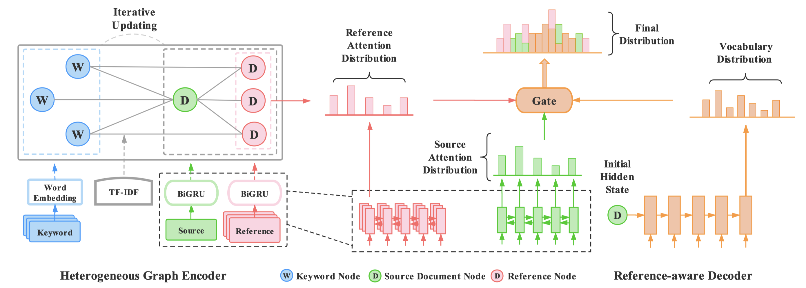

# GATER

This repository contains the code for our EMNLP 2021 paper “[Heterogeneous Graph Neural Networks for Keyphrase Generation](https://arxiv.org/pdf/2109.04703.pdf)”.




Our implementation is built on the source code from [keyphrase-generation-rl](https://github.com/kenchan0226/keyphrase-generation-rl) and [fastNLP](https://github.com/fastnlp/fastNLP). Thanks for their work.

If you use this code, please cite our paper:

```
@inproceedings{ye2021heterogeneous,
  title={Heterogeneous Graph Neural Networks for Keyphrase Generation},
  author={Ye, Jiacheng and Cai, Ruijian and Gui, Tao and Zhang, Qi},
  booktitle={Proceedings of EMNLP},
  year={2021}
}
```

## Dependency

- python 3.5+
- pytorch 1.0+
- dgl 0.4.3
- sentence_transformers 1.1.0
- faiss 1.6.3

## Dataset

The datasets can be downloaded from [here](https://drive.google.com/file/d/16d8nxDnNbRPAw2pVy42DjSTVnT0WzJKj/view?usp=sharing), which are the tokenized version of the datasets provided by [Ken Chen](https://github.com/kenchan0226/keyphrase-generation-rl):

- The `testsets` directory contains the five datasets for testing (i.e., inspec, krapivin, nus, and semeval and kp20k), where each of the datasets contains `test_src.txt`  and `test_trg.txt`.
- The `kp20k_sorted` directory contains the training and validation files (i.e., `train_src.txt`, `train_trg.txt`, `valid_src.txt` and  `valid_trg.txt`). 
- Each line of the `*_src.txt` file is the source document, which contains the tokenized words of `title <eos> abstract` .
- Each line of the `*_trg.txt` file contains the target keyphrases separated by an `;` character. For example, each line can be like `present keyphrase one;present keyphrase two;absent keyprhase one;absent keyphrase two`. 

## Quick Start

The whole process includes the following steps:

- **`Build tfidf`**: The `retrievers/build_tfidf.py` script is used to build the index for document retrieval.
- **`Preprocessing`**: The `preprocess.py` script numericalizes the `train_src.txt`, `train_trg.txt`,`valid_src.txt` and `valid_trg.txt` files, and produces `train.one2many.pt`, `valid.one2many.pt` and `vocab.pt`. 
- **`Training`**: The `train.py` script loads the `train.one2many.pt`, `valid.one2many.pt` and `vocab.pt` file and performs training. We evaluate the model every 8000 batches on the valid set, and the model will be saved if the valid loss is lower than the previous one.
- **`Decoding`**: The `predict.py` script loads the trained model and performs decoding on the five test datasets. The prediction file will be saved, which is like `predicted keyphrase one;predicted keyphrase two;…`. 
- **`Evaluation`**: The `evaluate_prediction.py` script loads the ground-truth and predicted keyphrases, and calculates the $F_1@5$ and $F_1@M$ metrics.

For the sake of simplicity, we provide an one-click script in the `script` directory. You can run the following command to run the whole process with `Gater` model:

```bash
# under `One2One` paradigm
bash scripts/run_gater_one2one.sh

# under `One2Seq` paradigm
bash scripts/run_gater_one2seq.sh

```

You can also run the baseline model with the following command:

```bash
# under `One2One` paradigm
bash scripts/run_one2one.sh

# under `One2Seq` paradigm
bash scripts/run_one2seq.sh
```

**Note:** 

* Please download and unzip the datasets in the `./data` directory first.
* The **`Preprocessing`** procedure takes time because we have to pre-retrieve similiar references for each samples, and we also store them for the preparation of the training stage. 
* To run all the bash files smoothly, you may need to specify the correct `home_dir` (i.e., the absolute path to `kg_gater` dictionary) and the gpu id for `CUDA_VISIBLE_DEVICES`. We provide a small amount of data to quickly test whether your running environment is correct. You can test by running the following command:

```bash
bash scripts/run_small_gater_one2seq.sh
```
